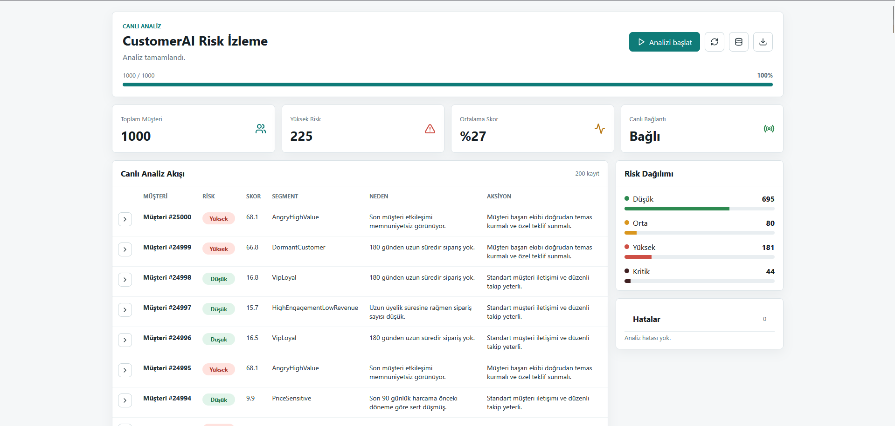

# CustomerAI Churn Prediction System

CustomerAI is a hybrid and explainable decision-support system that detects customer churn risk at an early stage by analyzing customer behavior. It uses order history, spending trends, sentiment scores, complaints, and interaction history to produce churn probability, final risk score, risk level, and customer segment outputs.

The core idea is not to let the machine learning model make the final business decision alone. Instead, the RandomForest churn probability is combined with a .NET-based rule engine, so both statistical model output and business risk rules contribute to the final decision.

## Screenshot

> Add the frontend dashboard screenshot to this path later.



## What It Does

- Detects risky customers before churn happens.
- Converts customer behavior into numerical feature vectors.
- Produces churn probability with a RandomForest model.
- Calculates a hybrid final risk score using a rule-based risk engine.
- Assigns customers into business segments such as `VipLoyal`, `DormantCustomer`, `AngryHighValue`, `PriceSensitive`, and `DiscountHunter`.
- Supports explainable AI analysis with SHAP, PDP, and ALE.
- Provides dashboard-based monitoring for analysis progress, risk distribution, and customer-level insights.

## Tech Stack

| Layer | Technologies |
|---|---|
| Backend API | .NET 8, ASP.NET Core Web API, Entity Framework Core, FluentValidation |
| Data Layer | SQL Server LocalDB, EF Core Migrations, Repository Pattern |
| ML Engine | Python, FastAPI, scikit-learn, pandas, NumPy, joblib |
| ML Model | RandomForestClassifier |
| Explainable AI | SHAP, PDP, ALE |
| Frontend | React 18, Vite, TypeScript, SignalR, HTML/CSS/JS dashboard |
| Realtime | SignalR Hub |
| Test / Demo Data | Bogus seed generator, scenario-based synthetic customer profiles |

## System Architecture

```text
SQL Server
  -> .NET Backend API
  -> CustomerBehaviorService
  -> FeatureExtractionService
  -> Python FastAPI AI Engine
  -> RandomForest Churn Prediction
  -> FinalRiskDecisionService
  -> SegmentAssignmentService
  -> Dashboard
```

At runtime, the .NET API extracts customer behavior, the Python AI Engine returns churn probability, and .NET services combine that probability with business risk rules to calculate the final risk score.

## ML Pipeline

The training pipeline follows this flow:

```text
Raw Customer Data
  -> CustomerBehaviorProfile generation
  -> Feature Extraction
  -> Training Dataset generation
  -> Label Generation
  -> Model Training
  -> Model Evaluation
  -> Model Export
```

Training produces the following model artifacts:

- `src/Backend/ai-engine/app/churn_model.pkl`
- `src/Backend/ai-engine/app/model_metadata.json`
- `src/Backend/ai-engine/app/feature_schema.json`

## Feature Schema

The current model feature set contains 16 columns:

| Feature | Description |
|---|---|
| `total_spend` | Total customer spending |
| `membership_days` | Customer membership duration |
| `recency_days` | Days since the last order |
| `order_count` | Total number of orders |
| `average_order_value` | Average value per order |
| `average_order_gap_days` | Average number of days between orders |
| `purchase_frequency` | Purchase frequency |
| `last_interaction_score` | Sentiment score of the latest interaction |
| `average_sentiment_score` | Average customer sentiment score |
| `interaction_count` | Total number of customer interactions |
| `complaint_count` | Number of customer complaints |
| `spend_last_30_days` | Spending in the last 30 days |
| `spend_last_90_days` | Spending in the last 90 days |
| `spend_drop_rate` | Spending decline ratio |
| `recency_bucket` | Derived risk bucket based on `recency_days` |
| `spend_trend_flag` | Derived flag representing a sharp spending decline |

## ML Model Performance

The model performance below is based on the experimental results reported in `CustomerAI_RAPOR_Final.docx`. The RandomForestClassifier model was evaluated on a dataset with 10,000 rows. A 20% holdout split was used, meaning 2,000 rows were kept as independent test data that the model did not see during training.

On the holdout test set, the model achieved 99.05% accuracy, 97.12% precision, 99.84% recall, and a 98.46% F1 score. High recall is especially important for churn prediction because missing a real churn customer is usually more expensive than producing a false alarm.

| Metric | Value |
|---|---:|
| Dataset Size | 10,000 rows |
| Holdout Test Set | 2,000 rows |
| Accuracy | 99.05% |
| Precision | 97.12% |
| Recall | 99.84% |
| F1 Score | 98.46% |
| ROC AUC | 0.999963 |

In the holdout test results, 1,981 predictions were correct and 19 predictions were incorrect. The model produced 18 false positives and only 1 false negative, showing that it is optimized to avoid missing customers who are likely to churn.

| Confusion Matrix Value | Count |
|---|---:|
| True Negative | 1375 |
| True Positive | 606 |
| False Positive | 18 |
| False Negative | 1 |

The project also includes a small synthetic scenario test package that represents business profiles such as VIP loyal customer, angry high-value customer, dormant customer, discount hunter, and silent churn risk. This scenario test does not replace the train/test split; it is used as an additional business-logic validation layer.

## Key Feature Importance Results

| Feature | Importance |
|---|---:|
| `average_sentiment_score` | 0.1544 |
| `last_interaction_score` | 0.1318 |
| `recency_days` | 0.1232 |
| `spend_drop_rate` | 0.0901 |
| `recency_bucket` | 0.0901 |
| `spend_last_90_days` | 0.0795 |
| `average_order_value` | 0.0620 |
| `complaint_count` | 0.0609 |

These results show that customer satisfaction, recent activity, and spending trend are the strongest global signals used by the model when estimating churn risk.

## API Endpoints

Python FastAPI AI Engine:

| Endpoint | Description |
|---|---|
| `POST /predict/churn` | Returns churn probability, predicted class, confidence, and explanation payload |
| `POST /model/reload` | Reloads the trained model |
| `GET /model/analysis/feature-importance` | Returns feature importance and SHAP-based analysis |
| `GET /model/analysis/pdp?feature=...` | Generates Partial Dependence Plot data |
| `GET /model/analysis/ale?feature=...` | Generates Accumulated Local Effects data |

.NET API:

| Endpoint | Description |
|---|---|
| `POST /api/Seed/generate-fake-data?count=1000` | Generates demo customer data |
| `POST /api/Analytics/analyze-all` | Runs analysis for all customers |
| `GET /api/Reports/dashboard` | Returns dashboard summary data |
| `GET /api/Reports/export-risky-customers` | Exports risky customers |

## Installation

### Requirements

- .NET 8 SDK
- Node.js 18+
- Python 3.11 recommended
- SQL Server LocalDB
- ODBC Driver 17 for SQL Server

### 1. Clone the Repository

```powershell
git clone https://github.com/<username>/customer-churn-prediction-ai.git
cd customer-churn-prediction-ai
```

### 2. Restore Backend Packages

```powershell
dotnet restore .\src\Backend\CustomerAI.sln
```

### 3. Create the Database

```powershell
dotnet ef database update --project .\src\Backend\CustomerAI.Data --startup-project .\src\Backend\CustomerAI.API
```

If `dotnet ef` is not installed:

```powershell
dotnet tool install --global dotnet-ef
```

### 4. Prepare the Python Environment

```powershell
cd .\src\Backend\ai-engine
python -m venv .venv
.\.venv\Scripts\Activate.ps1
pip install -r requirements.txt
cd ..\..\..
```

### 5. Generate Demo Data

First run the .NET API:

```powershell
dotnet run --project .\src\Backend\CustomerAI.API --launch-profile http
```

Then open a new terminal and call the seed endpoint:

```powershell
curl -X POST "http://localhost:5236/api/Seed/generate-fake-data?count=1000"
```

### 6. Train the ML Model

```powershell
cd src/Backend/ai-engine/app
python train_model.py
cd ../../../..
```

Alternative:

```powershell
cd src/Backend/ai-engine/app
python -m ml.train
cd ../../../..
```

After training, check that these files were created:

```text
churn_model.pkl
model_metadata.json
feature_schema.json
```

### 7. Run the Python AI Engine

```powershell
cd src/Backend/ai-engine/app
python main.py
```

The AI Engine runs at:

```text
http://127.0.0.1:5000
```

### 8. Run the .NET API

```powershell
dotnet run --project .\src\Backend\CustomerAI.API --launch-profile http
```

.NET API:

```text
http://localhost:5236
```

Swagger:

```text
http://localhost:5236/swagger
```

### 9. Run the Frontend

```powershell
cd src/Frontend
npm install
npm run dev
```

The Vite frontend usually opens at:

```text
http://127.0.0.1:5173
```

### 10. Start Analysis

You can start analysis from the dashboard or call the API directly:

```powershell
curl -X POST "http://localhost:5236/api/Analytics/analyze-all"
```

## Future Improvements

- Revalidation with real production churn labels
- Time-based holdout testing
- Kafka/RabbitMQ event streaming
- Online learning and model drift monitoring
- Wider segment-based recall analysis
- Cloud deployment and CI/CD pipeline

## License

This project was developed for educational and portfolio purposes. See the `LICENSE` file for license details.
